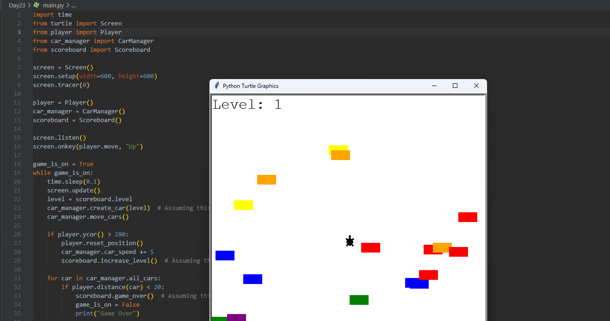

# 🐢 Turtle Crossing Game – Python Turtle Arcade Game

A fun little arcade-style game built using Python’s `turtle` module.  
Inspired by the classic **Frogger** game, this project is part of my #100DaysOfPython challenge.

---

## 🎮 Game Objective

Help the turtle cross the road safely by dodging incoming cars.  
Each time you reach the other side, you level up — and the cars get faster! 🚗💨

---

## 🧠 What I Learned

- Creating and managing multiple objects (cars) dynamically
- Using inheritance with a `Player` class
- Detecting collisions between objects
- Structuring code using clean OOP principles (`Player`, `CarManager`, `Scoreboard`)
- Game loop with real-time animation using `screen.update()` and `tracer(0)`

---

## 🛠️ Technologies Used

- Python 3.x
- Turtle graphics module (built-in)
- OOP: Custom classes like:
  - `Player`
  - `CarManager`
  - `Scoreboard`

---

## ▶️ How to Play

1. Clone the repo and navigate to the project folder.
2. Run the game:

```bash
python main.py
```
3. Controls:

🆙 Press Up Arrow to move the turtle forward

4. Game Ends:

❌ If you collide with a car

##📂 Project Structure
  📁 DayXX_TurtleCrossingGame/
    ├── main.py
    ├── player.py
    ├── car_manager.py
    ├── scoreboard.py
    ├── README.md

🌟 Part of My Python Game Series
This project is part of my Python game development journey:

🐍 Snake Game

🏓 Pong Game

🐢 Turtle Crossing Game

…and more to come!

📌 Full repo: 100 Days of Python Projects

Built with 🧠 Python, 🐢 Turtle, and 💪 consistency!

